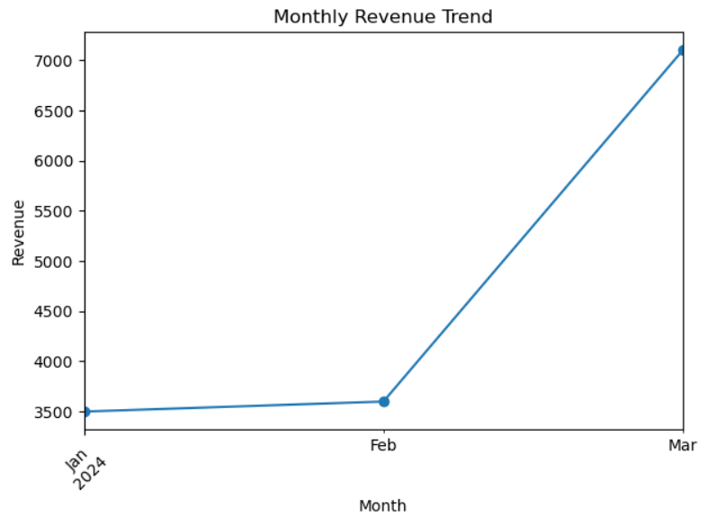

# E-commerce Customer & Revenue Analysis

## 📌 Overview

This project analyzes customer purchasing behavior and revenue trends using Python, SQL, and data visualization.

## 🎯 Objectives

- Identify top customers by spending
- Analyze revenue distribution across cities
- Track monthly revenue trends

## 🛠️ Tech Stack

- Python (Pandas)
- SQL
- Matplotlib
- VS Code / Jupyter Notebook

## 📂 Dataset

Custom dataset with:

- Orders (order_id, customer_id, order_date, amount)
- Customers (customer_id, name, city)

## 📊 Analysis Performed

- Total orders, customers, and revenue
- Customer-wise spending analysis
- City-wise revenue distribution (JOIN)
- Monthly revenue trend (time-based analysis)

## 📈 Visualization

- Bar chart: Revenue by City
- Line chart: Monthly Revenue Trend
- Pie chart: Customer Contribution

## 💡 Key Insights

- Customer 101 contributes the highest revenue
- Delhi generates the highest revenue among cities
- Revenue peaks in March, indicating growth trend

## 🚀 Outcome

Demonstrates end-to-end data analysis skills including data handling, SQL querying, feature engineering, and visualization.

## 📊 Ecommerce Dashboard

Total Orders: 10
Total Revenue: ₹14200

[Revenue by City chart]

[Monthly Trend chart]

## 🚀 Live Dashboard

[Click here to view the app](YOUR_LINK_HERE)
