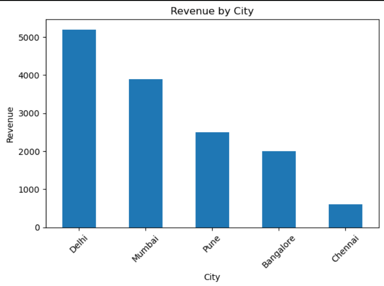

# 📊 E-commerce Customer & Revenue Analysis

## 📌 Overview

This project analyzes customer purchasing behavior and revenue trends to identify key business insights. It includes an interactive dashboard built using Streamlit for real-time data exploration.

---

## 🎯 Business Problem

Businesses need to understand:

- Who their top customers are
- Which cities generate the most revenue
- How revenue trends change over time

This project solves these questions using data analysis and visualization.

---

## 🔍 Solution Approach

- Data cleaning and analysis using **Pandas**
- SQL-based aggregation for business queries
- Data merging and transformation
- Visualization using **Matplotlib**
- Interactive dashboard using **Streamlit**

---

## 🛠️ Tech Stack

- Python (Pandas)
- SQL
- Matplotlib
- Streamlit
- VS Code / Jupyter Notebook

---

## 📂 Dataset

Custom dataset containing:

- **Orders** → order_id, customer_id, order_date, amount
- **Customers** → customer_id, name, city

---

## 📊 Key Analysis Performed

- Total orders, customers, and revenue calculation
- Customer-wise spending analysis
- City-wise revenue distribution (JOIN operations)
- Monthly revenue trend analysis
- KPI metrics and dashboard visualization

---

## 📈 Dashboard Features

- KPI cards (Total Orders, Revenue, Top Customer, Avg Order Value)
- City-based filtering
- Customer-based filtering
- Revenue by City (Bar Chart)
- Monthly Revenue Trend (Line Chart)
- Business insights section

---

## 💡 Key Insights

- Top customer contributes ~32% of total revenue
- Delhi generates the highest revenue among all cities
- Revenue shows an upward trend with peak in March
- Customer concentration indicates dependency on a few high-value users

---

## 📸 Dashboard Preview

### Main Dashboard

### Revenue by City

### Monthly Trend

---

## 🚀 Live Dashboard

👉 https://ecommerce-analysis-mudit.streamlit.app/

---

## 🎯 Outcome

This project demonstrates:

- End-to-end data analysis workflow
- SQL + Python integration
- Business insight generation
- Dashboard development using Streamlit

---

## 📌 Future Improvements

- Add more filters (date range, segments)
- Integrate larger real-world dataset
- Deploy advanced analytics (cohort analysis, segmentation)

---

## 👨‍💻 Author

**Mudit Kumar Singh**
